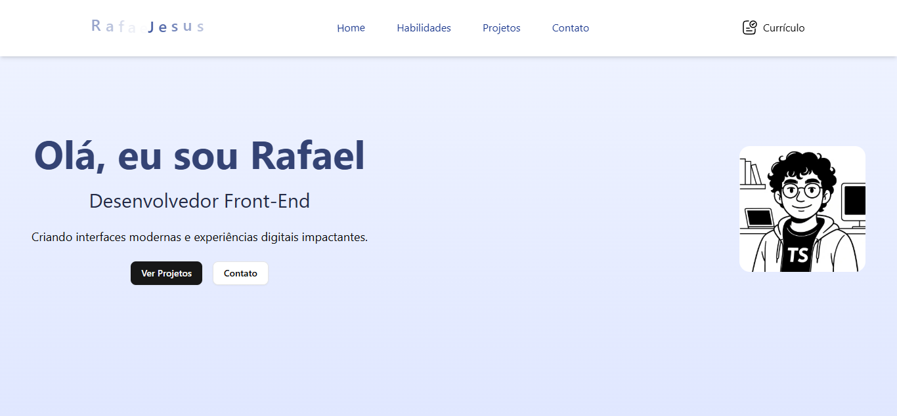

# 🚀 Rafael de Jesus — Portfólio Front-end

Este é o repositório do meu portfólio pessoal como desenvolvedor **Front-end**, criado com foco em performance, acessibilidade, animações suaves e um design limpo. Aqui você encontrará meus projetos, habilidades e formas de contato.

 <!-- Altere para o path correto da sua imagem -->

## 🔧 Tecnologias Utilizadas

- ⚡ **Next.js** — Framework React moderno para aplicações web rápidas, com suporte a SSR/SSG.
- 💡 **TypeScript** — Tipagem estática para maior segurança e escalabilidade do código.
- ✨ **Framer Motion** — Biblioteca poderosa para animações fluidas e interações dinâmicas.
- 🎨 **Tailwind CSS** — Framework utilitário para estilização rápida e responsiva com classes otimizadas.
- 🧩 **ShadCN UI** — Componentes acessíveis e estilizados prontos para uso, com integração com Tailwind.
- 🌐 **Open Graph + SEO** — Metadados bem configurados para otimização em mecanismos de busca e compartilhamento social.

## 🧠 O que você encontrará

- 👨‍💻 Apresentação profissional com animação no nome
- 🔗 Seção com navegação suave (scroll suave)
- 📱 Layout 100% responsivo
- 📂 Projetos desenvolvidos com links e imagens
- 📄 Botão para download de currículo
- 🧼 Interface limpa e moderna com foco na experiência do usuário

## 📦 Como rodar localmente

```bash
# Clone o repositório
git clone https://https://github.com/HEROjesus/Portfolio.git

# Acesse a pasta do projeto
cd seu-repo

# Instale as dependências
npm install

# Inicie o servidor de desenvolvimento
npm run dev
````

Acesse: [link](https://portifolio-omega-sandy-22.vercel.app/)

## 📄 Licença

Este projeto está sob a licença MIT. Veja o arquivo [LICENSE](./LICENSE) para mais detalhes.

---
